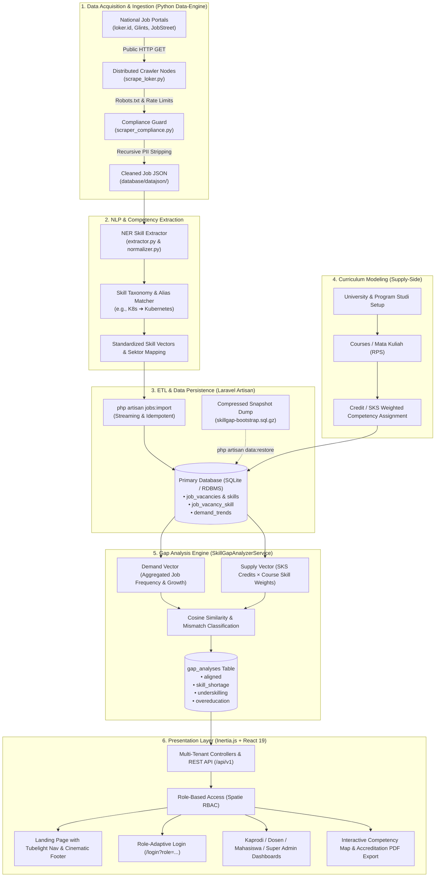

# System Flow, Tech Stack, and Risk Assessment
**Skill Gap Analyzer (Curriculum Intelligence Platform)**  
*Document Version: 1.0 — KMIPN VIII Academic & Engineering Specification*

---

## 1. Executive Summary & System Overview

**Skill Gap Analyzer** is a data-driven *Curriculum Intelligence* platform designed to bridge the structural mismatch (*skill gap*) between **Supply** (Vocational Higher Education curriculum, RPS, and course learning outcomes) and **Demand** (real-time industry competencies extracted from tens of thousands of job vacancies across national job portals like loker.id, Glints, and JobStreet).

Unlike conventional tracer studies that are retroactive and qualitative, this platform utilizes automated web crawling, Natural Language Processing (NER & Semantic Matching), and weighted matrix analysis to provide quantitative, actionable recommendations:
- **For Ketua Program Studi (Kaprodi):** Program-wide curriculum alignment index, mismatch taxonomy maps (*underskilling*, *skill shortages*), and exportable evidence matrices for **LAM-INFOKOM** and **BAN-PT** accreditation.
- **For Lecturers (Dosen):** Per-course syllabus gap evaluations and targeted practical lab topics aligned with current market needs.
- **For Students (Mahasiswa):** Career readiness index based on completed coursework and industry requirements for personalized self-learning portfolios.
- **For Super Admin / Operations:** Real-time crawler agent infrastructure telemetry, job ingestion pipeline health, and multi-campus tenancy management.

---

## 2. End-to-End System Flow

### Detailed Flow Stages:
1. **Data Crawling & Compliance:**  
   Python-based scrapers query target job listings respecting `robots.txt`, enforcing crawl delays (≥ 2.0s), and adhering to Indonesian Privacy Law (**UU PDP No. 27/2022**) by stripping contact PII (emails, phone numbers, recruiter names, ID cards).
2. **NLP Competency Extraction & Normalization:**  
   Job descriptions are processed to identify hard/soft skills, programming languages, libraries, tools, and certifications. Entity variations are unified against the `skill_aliases` catalog (e.g. `ReactJS` $\rightarrow$ `React.js`).
3. **ETL & Data Pipeline:**  
   Laravel Artisan command `jobs:import` streams clean data into relational tables idempotently via unique vacancy slugs. Historical aggregates calculate rolling `demand_trends` (frequency, percentage, and growth rate).
4. **Curriculum Supply Modeling:**  
   Academic departments register Courses, Semesters, Credit weights (SKS), and Learning Outcomes (CPMK), linking them to standardized skills in the taxonomy.
5. **Analytical Matching Engine:**  
   `SkillGapAnalyzerService` contrasts industry demand weights with academic supply credits, categorizing competencies into:
   - **Aligned (Selaras):** Taught in curriculum and actively required by industry.
   - **Skill Shortage (Kritis):** High industry demand, completely absent from the syllabus.
   - **Underskilling (Minor Gap):** Mentioned in curriculum, but with insufficient depth or outdated frameworks compared to market requirements.
   - **Overeducation:** Advanced legacy topics heavily taught with negligible market demand.
6. **Frontend Visual Delivery:**  
   Inertia.js securely passes hydrated state to React 19 pages without full page reloads, providing role-segmented analytics and export tools.

---

## 3. Technology Stack Breakdown

| Layer / Component | Technology | Version | Purpose & Rationale |
|---|---|---|---|
| **Backend Framework** | **Laravel** | `13.x` / `12.x` | Robust PHP enterprise framework, native CLI scheduling, Eloquent ORM, and dependency injection. |
| **API & Monolith Bridge**| **Inertia.js (Laravel & React)**| `@inertiajs/react ^3.6.1` | Eliminates REST boilerplate; provides SPA speed with server-driven routing, sessions, and security. |
| **Authentication & RBAC**| **Spatie Laravel Permission** | `^8.3` | Fine-grained roles: `super_admin`, `kaprodi`, `dosen`, `mahasiswa` with dedicated model relations. |
| **Frontend Framework** | **React & React DOM** | `^19.2.8` | Modern declarative component architecture, Server/Client components, and fast concurrent rendering. |
| **Styling & Design System** | **Tailwind CSS (Vite)** | `^4.0.0` | High-performance CSS-in-utility styling adhering to Neo-Brutalist / Industrial Academic aesthetic. |
| **Micro-Animations & UI** | **Framer Motion & GSAP** | `framer-motion ^13`, `gsap ^3.15` | Fluid page transitions, tubelight navigation lamp, parallax watermarks, and smooth scroll physics. |
| **Data Visualization** | **Chart.js** | `^4.5.1` | Lightweight, canvas-rendered bar charts, radar matrices, and match-rate visualizers. |
| **Iconography & Fonts** | **Lucide React, Outfit, Inter**| Latest | Professional, high-density iconography and engineered typography. |
| **Primary Database** | **SQLite (Dev/Academic)** | `PDO SQLite 3` | Zero-configuration, zero-latency serverless database bundled with `.sql.gz` data hydration. |
| **Data Engine & Crawlers** | **Python** | `3.11+` | Scrapy / BeautifulSoup4 / HTTPX scrapers with custom regex NER and NLP cosine-similarity modules. |
| **Build & Bundling** | **Vite** | `^8.0.0` | Ultra-fast HMR and optimized production bundle compression. |
| **Testing Frameworks** | **PHPUnit & Pytest** | `PHPUnit 12`, `pytest` | 66+ test suites with 240+ assertions covering jobs, imports, gap analysis, and auth flows. |

---

## 4. Foreseeable Risks & Comprehensive Mitigation Strategies

### Risk Matrix Overview

| # | Risk Category | Threat Description | Probability | Impact | Mitigation Status |
|---|---|---|---|---|---|
| **R1** | **Legal & Regulatory** | Job portal Terms of Service (ToS) changes or copyright claims on listings | Medium | High | ✅ Mitigated via UU PDP & Transformative Data Policy |
| **R2** | **Technical (Scraping)**| Anti-bot barriers (Cloudflare, CAPTCHA, IP blocks) breaking data freshness | High | Medium | ✅ Mitigated via Adaptive Delays & Fallback Snapshots |
| **R3** | **Data Integrity** | PII leakage from raw job recruiter contacts violating **UU No. 27/2022** | Low | Critical | ✅ Mitigated via Ingestion-Time Recursive Stripping |
| **R4** | **NLP & Semantics** | Semantic drift, buzzword dilution, or homonym false-positives (e.g. "Go" lang) | Medium | Medium | ✅ Mitigated via Alias Catalog & Contextual Filters |
| **R5** | **Database Concurrency**| SQLite write-lock saturation during concurrent crawling and web analysis | Medium | High | ⚠️ Architecture Plan Ready (SQLite WAL / PostgreSQL) |
| **R6** | **Curriculum Modeling** | Subjective RPS input and varying credit-hour depth across different universities | High | Medium | ✅ Mitigated via Bloom's Taxonomy & Normalized Weights |
| **R7** | **Security & Multi-Tenancy**| Data cross-contamination between different university study programs | Low | High | ✅ Mitigated via Strict Eloquent Program Scopes & RBAC |

---

### In-Depth Risk Analysis & Contingency Plans

### 1. Data Scraping, Anti-Bot Barriers & Source Fragility
- **The Issue:** Commercial job boards frequently update DOM structures, introduce JavaScript rendering barriers, and implement Cloudflare/Akamai bot detection.
- **Impact:** Python scrapers failing or returning 403 Forbidden, halting periodic demand updates.
- **Mitigation:**
  1. **Decoupled Architecture:** The web app does not scrape live. Crawling is asynchronous via `data-engine/`.
  2. **Idempotent Snapshot Restore:** The repository ships with compressed pre-built datasets (`database/dumps/skillgap-bootstrap.sql.gz`) containing 8,200+ verified vacancies and 17,000+ skill relations.
  3. **Respectful Crawling:** Built-in 2.0s delays, User-Agent transparency, and exponential backoff prevent aggressive rate limit triggers.

### 2. Legal Compliance & Personal Data Protection (UU PDP No. 27/2022)
- **The Issue:** Job vacancy descriptions frequently contain recruiter emails, direct WhatsApp numbers, and personal identity data. Retaining this violates Indonesian privacy laws.
- **Impact:** Administrative sanctions or reputational damage for academic institutions.
- **Mitigation:**
  1. `scraper_compliance.py` performs recursive string sanitization before saving raw JSON.
  2. The system stores **only skill metadata, company name, sector, and salary ranges**. Contact fields (`email`, `phone`, `ktp`, `pic_name`) are permanently discarded prior to database insertion.
  3. Compliance documentation is maintained in `LEGAL_COMPLIANCE_RUNBOOK.md`.

### 3. NLP Entity Recognition & Ambiguity (Semantic Drift)
- **The Issue:** Technical acronyms can be ambiguous (e.g., `Go` the language vs common verb "go", `C` vs `C++`, `Flutter` vs general movement). New frameworks appear faster than taxonomy updates.
- **Impact:** Skewed demand statistics, artificially inflating non-existent skills or misattributing skills.
- **Mitigation:**
  1. **Strict Contextual Matching:** Words shorter than 3 letters require boundary checks and tech-industry sector contexts.
  2. **Alias Resolution Dictionary:** `skill_aliases` table normalizes variations (e.g., `Node`, `NodeJS`, `Node.js` $\rightarrow$ `Node.js`).
  3. **Human-in-the-loop Taxonomy Management:** Kaprodi and Super Admins can manually merge, rename, or deactivate skills via the Taxonomy Manager interface (`/taxonomy`).

### 4. Concurrency & Storage Scalability (SQLite Limits)
- **The Issue:** The project currently defaults to SQLite for academic portability. SQLite allows multiple readers but locks the entire database file during writes.
- **Impact:** Heavy `jobs:import` batch tasks while multiple users are saving course RPS modifications could produce `database is locked` errors.
- **Mitigation:**
  1. SQLite is configured with **WAL (Write-Ahead Logging)** mode and a busy timeout.
  2. Production deployment guide specifies switching `.env` `DB_CONNECTION` to **PostgreSQL** or **MariaDB/MySQL**, requiring zero code changes thanks to Laravel Eloquent abstraction.
  3. Analysis results are pre-calculated and cached in `gap_analyses` rather than calculated on-the-fly during user dashboard page requests.

### 5. Academic Subjectivity in Curriculum SKS Weighting
- **The Issue:** A 3-SKS course mentioning "Docker" once in a 2-hour lecture does not mean students have industry-level container orchestration proficiency.
- **Impact:** Curriculum could report high alignment (*Selaras*) while graduates still face real-world knowledge gaps.
- **Mitigation:**
  1. The algorithm multiplies SKS credits by practical intervention toggles (e.g., whether the course includes hands-on lab projects or independent certifications).
  2. Four-tier taxonomy classification distinguishes between superficial mentions (*Underskilling*) and comprehensive competence.

---

## 5. Standard Operational Runbook

| Operation | Command / Action | Frequency |
|---|---|---|
| **Run Full Test Suite** | `php artisan test` & `cd data-engine && pytest` | Prior to any commit/deployment |
| **Restore Job Snapshot** | `php artisan data:restore` | Initial installation / reset |
| **Import Fresh Crawl Data** | `php artisan jobs:import --limit=1000` | Weekly / Monthly ingestion |
| **Download Company Logos** | `php artisan jobs:fetch-logos` | Post-import |
| **Regenerate Master Dump** | `php artisan data:dump` | After verifying new dataset |
| **Trigger Full Gap Analysis**| `php artisan tinker --execute="app(App\Services\Analysis\SkillGapAnalyzerService::class)->analyze();"` | After each curriculum revision |

---

*Authored for the Skill Gap Analyzer Core Engineering Team — Vocational Higher Education Link & Match Initiative.*
