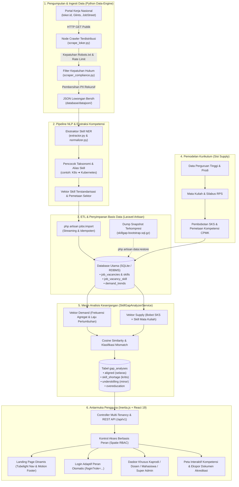

# Alur Sistem, Tech Stack, dan Analisis Risiko
**Skill Gap Analyzer (Platform Curriculum Intelligence Vokasi)**  
*Versi Dokumen: 1.0 — Spesifikasi Rekayasa & Akademik KMIPN VIII*

[🇬🇧 Read English Version](file:///c:/Users/lunox/Documents/Skillgapanalyzer/UNDERSTANDING.md)

---

## 1. Ringkasan Eksekutif & Gambaran Umum Sistem

**Skill Gap Analyzer** adalah platform *Curriculum Intelligence* berbasis data yang dirancang untuk menjembatani ketidakselarasan struktural (*skill gap / mismatch*) antara **Sisi Penyedia / Supply** (Kurikulum Pendidikan Tinggi Vokasi, RPS, dan Capaian Pembelajaran Mata Kuliah/CPMK) dengan **Sisi Kebutuhan Pasar / Demand** (kompetensi riil industri yang diekstraksi dari puluhan ribu lowongan kerja di portal bursa kerja nasional seperti loker.id, Glints, dan JobStreet).

Berbeda dari metode *tracer study* konvensional yang bersifat retrospektif (terlambat) dan kualitatif, platform ini menggunakan *web crawling* otomatis, Pemrosesan Bahasa Alami (*NLP Entity Recognition & Semantic Vector Matching*), serta analisis matriks terbobot untuk menghasilkan rekomendasi kuantitatif yang dapat langsung dieksekusi:
- **Ketua Program Studi (Kaprodi):** Indeks keselarasan kurikulum tingkat program studi, peta taksonomi ketimpangan (*underskilling*, *skill shortages*), serta matriks bukti evaluasi siap ekspor untuk akreditasi **LAM-INFOKOM** dan **BAN-PT**.
- **Dosen Pengampu:** Evaluasi kesenjangan silabus per mata kuliah beserta rekomendasi topik praktikum modern sesuai kebutuhan pasar kerja terkini.
- **Mahasiswa:** Indeks kesiapan karir berbasis mata kuliah yang telah diselesaikan dan panduan kompetensi tambahan untuk portofolio mandiri.
- **Super Admin / Tim Operasional:** Telemetri infrastruktur *node crawler*, pemantauan kesehatan pipa data (*pipeline*), serta manajemen *multi-tenancy* kampus.

---

## 2. Alur Sistem Menyeluruh (End-to-End System Flow)

### Penjelasan Tahapan Alur:
1. **Perayapan Data & Kepatuhan Hukum:**  
   Crawler berbasis Python mengumpulkan data lowongan kerja secara terjadwal dengan mematuhi aturan `robots.txt`, menerapkan jeda perayapan (*crawl delay* $\ge$ 2.0 detik), dan menaati **UU Perlindungan Data Pribadi (UU PDP No. 27/2022)** melalui pembersihan otomatis seluruh data kontak pribadi (email, nomor WhatsApp/telepon, nama perekrut/HR, NIK).
2. **Ekstraksi NLP & Normalisasi Entitas:**  
   Teks deskripsi lowongan diproses menggunakan algoritma NER (*Named Entity Recognition*) untuk mengekstraksi keterampilan teknis (*hard skills*), keterampilan lunak (*soft skills*), perangkat lunak, dan sertifikasi. Variasi penulisan diseragamkan melalui tabel kamus `skill_aliases` (misal `ReactJS` $\rightarrow$ `React.js`).
3. **Pipa ETL & Penyimpanan Data:**  
   Perintah Laravel Artisan `jobs:import` membaca data secara *streaming* dan menyimpannya secara *idempoten* (mencegah duplikasi data berdasarkan slug lowongan). Agregasi berkala menghasilkan tabel `demand_trends` (frekuensi kemunculan, persentase pasar, dan laju pertumbuhan).
4. **Pemodelan Kurikulum Akademik (Supply):**  
   Pengelola program studi mendaftarkan struktur kurikulum, semester, bobot SKS mata kuliah, dan Capaian Pembelajaran Mata Kuliah (CPMK) yang kemudian dihubungkan ke taksonomi keterampilan standar.
5. **Mesin Komparasi & Analisis Kesenjangan:**  
   Layanan backend `SkillGapAnalyzerService` membandingkan vektor kebutuhan industri dengan suplai kurikulum vokasi, lalu mengklasifikasikannya ke dalam 4 kuadran taksonomi:
   - **Aligned (Selaras):** Diajarkan dalam kurikulum dan aktif dibutuhkan oleh industri.
   - **Skill Shortage (Kritis):** Sangat dibutuhkan industri, namun belum diajarkan sama sekali dalam silabus.
   - **Underskilling (Minor Gap):** Disebutkan dalam materi kuliah, namun kedalaman materi atau perangkat yang diajarkan tertinggal dibanding standar industri terkini.
   - **Overeducation:** Keterampilan lampau/usang yang diajarkan secara intensif padahal permintaannya di pasar kerja sudah sangat minim.
6. **Penyajian Data di Sisi Frontend:**  
   Inertia.js menyalurkan status (*state*) terhidrasi dari backend ke komponen React 19 secara instan tanpa *full page reload*, menyajikan visualisasi data yang disesuaikan dengan hak akses masing-masing pengguna.

---

## 3. Rincian Tumpukan Teknologi (Tech Stack)

| Lapisan / Komponen | Teknologi | Versi | Alasan & Peran dalam Sistem |
|---|---|---|---|
| **Backend Framework** | **Laravel** | `13.x` / `12.x` | Kerangka kerja PHP modern dengan arsitektur tangguh, CLI task scheduling (*Artisan*), Eloquent ORM, dan *dependency injection*. |
| **Jembatan Monolith & SPA**| **Inertia.js (Laravel & React)**| `@inertiajs/react ^3.6.1` | Menghilangkan kerumitan pembuatan REST API terpisah; memberikan kecepatan *Single Page Application* (SPA) dengan kenyamanan *routing* dan sesi server. |
| **Otentikasi & Otorisasi**| **Spatie Laravel Permission** | `^8.3` | Pengelolaan hak akses berbasis peran (RBAC): `super_admin`, `kaprodi`, `dosen`, dan `mahasiswa`. |
| **Frontend Framework** | **React & React DOM** | `^19.2.8` | Arsitektur komponen deklaratif terbaru dengan performa render *concurrent* yang optimal. |
| **Styling & Desain Sistem** | **Tailwind CSS (Vite Engine)**| `^4.0.0` | Kerangka utilitas CSS modern berkecepatan tinggi dengan estetika *Industrial Academic / Neo-Brutalist*. |
| **Animasi & Interaksi Visual** | **Framer Motion & GSAP** | `framer-motion ^13`, `gsap ^3.15` | Transisi halaman halus, indikator *tubelight navigation*, efek *magnetic buttons*, dan *parallax watermark* footer. |
| **Visualisasi Data** | **Chart.js** | `^4.5.1` | Render diagram batang, radar, dan visualisasi pengukur persentase keselarasan berbasis kanvas HTML5 yang ringan. |
| **Tipografi & Ikonografi** | **Lucide React, Outfit, Inter**| Versi Terbaru | Tipografi modern dengan kontras tinggi serta paket ikon vektor lengkap dan konsisten. |
| **Basis Data Utama** | **SQLite (Dev/Akademik)** | `PDO SQLite 3` | Basis data serverless berlatensi nol tanpa konfigurasi rumit, didukung mekanisme restorasi data terkompresi `.sql.gz`. |
| **Data Engine & Crawler** | **Python** | `3.11+` | Skrip pengumpul data menggunakan BeautifulSoup4 & HTTPX, dilengkapi regex NER dan modul *cosine similarity*. |
| **Build Tool & Bundler** | **Vite** | `^8.0.0` | Kompilasi aset ultra-cepat dengan Hot Module Replacement (HMR) dan kompresi bundle produksi. |
| **Kerangka Pengujian** | **PHPUnit & Pytest** | `PHPUnit 12`, `pytest` | 66+ *test suite* dengan 240+ asersi yang menguji alur autentikasi, impor data, dan algoritma *gap analysis*. |

---

## 4. Analisis Risiko yang Dapat Diantisipasi & Strategi Mitigasi

### Matriks Pemetaan Risiko

| # | Kategori Risiko | Deskripsi Ancaman | Probabilitas | Dampak | Status Mitigasi |
|---|---|---|---|---|---|
| **R1** | **Hukum & Regulasi** | Perubahan Ketentuan Layanan (ToS) situs bursa kerja atau hak cipta konten lowongan | Sedang | Tinggi | ✅ Dimitigasi (UU PDP & Kebijakan Data Transformatif Non-Komersial) |
| **R2** | **Teknis (Scraping)**| Mekanisme anti-bot (Cloudflare, CAPTCHA, IP block) yang menghentikan data crawler | Tinggi | Sedang | ✅ Dimitigasi (Penerapan Jeda Adaptif & Cadangan Snapshot Dump) |
| **R3** | **Privasi & Keamanan**| Kebocoran informasi kontak HR/rekruter yang melanggar **UU No. 27/2022 (UU PDP)** | Rendah | Kritis | ✅ Dimitigasi (Pembersihan Rekursif Saat Ingesti Mentah) |
| **R4** | **NLP & Semantik** | Pergeseran makna (*semantic drift*), akronim ambigu (contoh bahasa "Go", "C", "Flutter") | Sedang | Sedang | ✅ Dimitigasi (Katalog Alias & Filter Batasan Kata Kontekstual) |
| **R5** | **Konkurensi Database**| Penguncian file SQLite (*database locked*) saat impor data massal bersamaan dengan akses web | Sedang | Tinggi | ⚠️ Skema Terencana (Mode WAL Aktif / Migrasi Siap ke PostgreSQL) |
| **R6** | **Pemodelan Kurikulum**| Subjektivitas penginputan materi RPS dan ketimpangan kedalaman bobot SKS antarkampus | Tinggi | Sedang | ✅ Dimitigasi (Taksonomi Bloom & Penyesuaian Bobot Praktikum) |
| **R7** | **Multi-Tenancy** | Kebocoran data evaluasi kurikulum antar-program studi atau perguruan tinggi berbeda | Rendah | Tinggi | ✅ Dimitigasi (Pemisahan Lingkup Query Eloquent & Otorisasi RBAC) |

---

### Analisis Mendalam & Solusi Pencegahan

### 1. Perayapan Data, Proteksi Anti-Bot, dan Kerentanan Sumber
- **Masalah:** Situs portal kerja komersial secara berkala memperbarui struktur DOM HTML, menerapkan rendering berbasis JavaScript penuh, atau memasang perlindungan Cloudflare/Akamai.
- **Dampak:** Skrip crawler Python berpotensi mengalami kegagalan (HTTP 403 Forbidden), sehingga pembaruan tren kebutuhan pasar terhambat.
- **Solusi Mitigasi:**
  1. **Arsitektur Terpisah (*Decoupled*):** Aplikasi web tidak melakukan scraping secara langsung (*live*). Seluruh proses crawling berjalan terisolasi di latar belakang melalui modul `data-engine/`.
  2. **Pemulihan Snapshot Idempoten:** Repositori menyertakan data prapaket yang telah divalidasi (`database/dumps/skillgap-bootstrap.sql.gz`) berisi 8.200+ lowongan dan 17.000+ relasi keahlian siap pakai.
  3. **Etika Perayapan Santun (*Polite Scraping*):** Crawler menyertakan identitas User-Agent yang transparan, jeda permintaan minimal 2 detik, dan mekanisme *exponential backoff* agar tidak membebani server sumber.

### 2. Kepatuhan Hukum & Perlindungan Data Pribadi (UU PDP No. 27/2022)
- **Masalah:** Deskripsi lowongan kerja kerap menyertakan email pribadi HR, nomor telepon/WhatsApp langsung, atau identitas narahubung rekruter. Menyimpan data ini tanpa izin melanggar undang-undang privasi di Indonesia.
- **Dampak:** Sanksi administratif dan risiko reputasi bagi institusi pendidikan vokasi pengembang sistem.
- **Solusi Mitigasi:**
  1. Skrip `scraper_compliance.py` secara otomatis menghapus seluruh field kontak dan identitas pribadi secara rekursif sebelum teks disimpan ke file JSON mentah.
  2. Sistem **hanya menyimpan metadata kompetensi keahlian, nama perusahaan, sektor industri, dan rentang gaji**. Informasi kontak individu (`email`, `phone`, `ktp`, `pic_name`) tidak pernah dimasukkan ke basis data.
  3. Panduan operasional kepatuhan terdokumentasi lengkap di [LEGAL_COMPLIANCE_RUNBOOK.md](file:///c:/Users/lunox/Documents/Skillgapanalyzer/LEGAL_COMPLIANCE_RUNBOOK.md).

### 3. Ketepatan Ekstraksi NLP & Kerancuan Semantik (*Semantic Drift*)
- **Masalah:** Akronim teknologi rentan memicu salah deteksi (contoh: bahasa pemrograman `Go` disalahartikan sebagai kata kerja umum bahasa Inggris *go*, huruf `C` tertukar dengan penomoran poin, atau `Flutter` disalahartikan sebagai getaran). Selain itu, istilah teknologi baru muncul sangat cepat.
- **Dampak:** Data kebutuhan pasar menjadi bias atau menggelembungkan statistik keterampilan yang sebenarnya tidak diminta.
- **Solusi Mitigasi:**
  1. **Pemeriksaan Batasan Kata (*Word Boundary & Context Checks*):** Istilah dengan panjang kurang dari 3 karakter diwajibkan melewati filter konteks sektor teknologi informasi.
  2. **Kamus Penyeragaman Alias:** Tabel `skill_aliases` menstandarisasi variasi istilah penulisan (contoh: `Node`, `NodeJS`, `Node.js` disatukan menjadi `Node.js`).
  3. **Manajemen Taksonomi Mandiri (*Human-in-the-Loop*):** Kaprodi dan Super Admin memiliki antarmuka khusus (`/taxonomy`) untuk menggabungkan (*merge*), menonaktifkan, atau memperbarui nama keterampilan secara berkala.

### 4. Skalabilitas Penyimpanan & Konkurensi (Batas Kemampuan SQLite)
- **Masalah:** Proyek saat ini menggunakan SQLite demi kemudahan portabilitas akademik tanpa instalasi server database mandiri. Namun, SQLite mengunci seluruh file saat terjadi operasi penulisan (*write lock*).
- **Dampak:** Operasi impor massal (`jobs:import`) yang berjalan bersamaan dengan pembaruan data RPS oleh banyak dosen dapat memicu eror `database is locked`.
- **Solusi Mitigasi:**
  1. Konfigurasi SQLite dioptimalkan dengan mode **WAL (Write-Ahead Logging)** dan pengaturan batas waktu antrean (*busy timeout*).
  2. Arsitektur backend memanfaatkan abstraksi Laravel Eloquent murni. Untuk lingkungan produksi berskala besar, sistem dapat dialihkan ke **PostgreSQL** atau **MariaDB/MySQL** cukup dengan mengubah parameter pada file `.env` tanpa merombak baris kode aplikasi.
  3. Hasil komputasi keselarasan disimpan dalam bentuk *cache* pada tabel `gap_analyses`, sehingga permintaan akses dashboard pengguna tidak perlu menghitung ulang matriks rumit secara waktu-nyata (*on-the-fly*).

### 5. Subjektivitas Akademik dalam Pembobotan SKS Kurikulum
- **Masalah:** Mata kuliah 3 SKS yang hanya menyinggung teknologi tertentu (misal "Docker") dalam satu sesi kuliah teori 2 jam belum mencerminkan penguasaan tingkat industri.
- **Dampak:** Dashboard dapat menghasilkan status "Selaras" yang semu, padahal mahasiswa belum memiliki kompetensi praktis yang siap kerja.
- **Solusi Mitigasi:**
  1. Algoritma menyertakan parameter intervensi kurikulum (apakah topik didukung modul praktikum laboratorium mandiri atau sertifikasi kompetensi industri).
  2. Sistem taksonomi membedakan dengan tegas antara pengenalan dasar yang kurang memadai (*Underskilling*) dengan penguasaan kompetensi penuh.

---

## 5. Petunjuk Operasional Standar (Operational Runbook)

| Operasi / Tindakan | Perintah Terminal | Frekuensi Pelaksanaan |
|---|---|---|
| **Menjalankan Pengujian Lengkap** | `php artisan test` & `cd data-engine && pytest` | Sebelum *commit* atau rilis fitur baru |
| **Memulihkan Snapshot Data Lowongan** | `php artisan data:restore` | Instalasi awal sistem atau *reset* lingkungan |
| **Mengimpor Data Hasil Crawling Baru** | `php artisan jobs:import --limit=1000` | Berkala (mingguan / bulanan) |
| **Mengunduh Logo Perusahaan** | `php artisan jobs:fetch-logos` | Setelah proses impor lowongan baru |
| **Membuat Ulang Dump Master Data** | `php artisan data:dump` | Setelah dataset baru diverifikasi kualitasnya |
| **Memicu Analisis Ulang Kesenjangan** | `php artisan tinker --execute="app(App\Services\Analysis\SkillGapAnalyzerService::class)->analyze();"` | Setiap ada pembaruan pada data RPS kurikulum |

---

*Disusun untuk Tim Rekayasa Inti Skill Gap Analyzer — Inisiatif Link & Match Pendidikan Tinggi Vokasi Nasional.*
