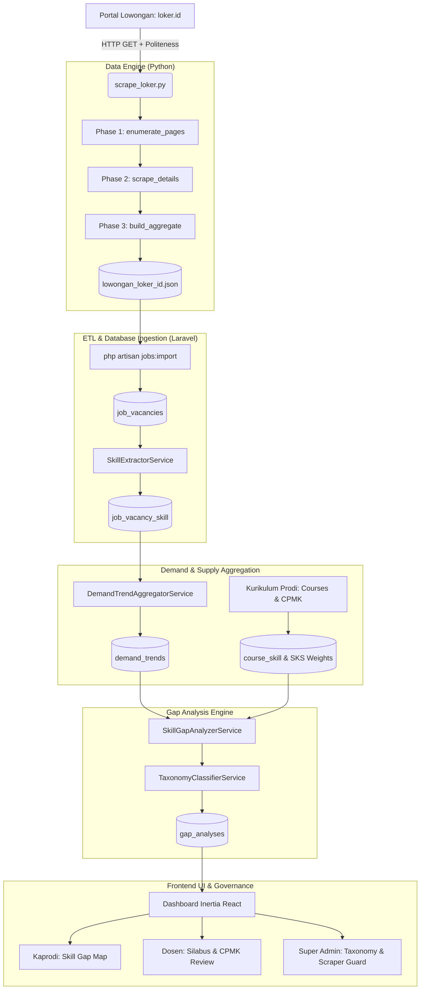
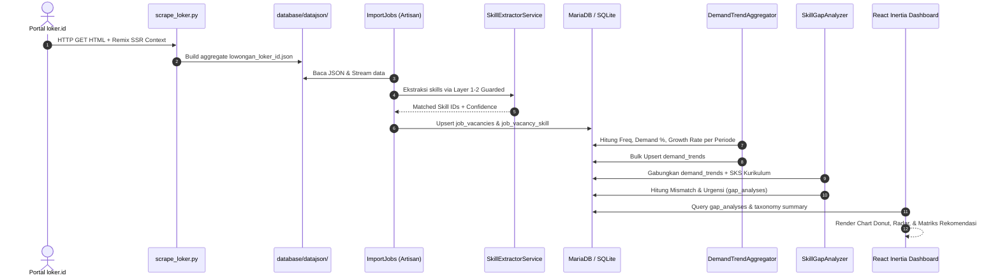

# 📘 Dokumentasi Teknis Menyeluruh: Scraper, Hybrid Extractor, Normalizer & Taksonomi
**Skill Gap Analyzer (Platform Curriculum Intelligence Vokasi)**  
*Dokumen Arsitektur Teknis, Logika Ekstraksi, Taksonomi & Bukti Kesinambungan End-to-End*

---

## 1. Arsitektur & Peta Aliran Data (End-to-End Trace)

Sistem beroperasi melalui pipa data terintegrasi yang menghubungkan akuisisi data pasar kerja mentah hingga visualisasi kesenjangan kurikulum di tingkat antarmuka pengguna:



---

## 2. Logika Scraper Data (`scrape_loker.py`)

### 2.1 Arsitektur 3-Phase
1. **Phase 1 — `enumerate_pages()`**:
   - Menelusuri seluruh halaman katalog (`/cari-lowongan-kerja/page/{n}`).
   - Mengambil konteks JavaScript SSR Remix: `window.__remixContext`.
   - Mengumpulkan seluruh `id`, `slug`, dan `job_skills` ke `database/datajson/_index.json` serta mengarsipkan HTML JSON mentah per halaman di `_listing/page_{n}.json`.
2. **Phase 2 — `scrape_details()`**:
   - Membaca daftar ID dari `_index.json`.
   - Mengunduh detail pekerjaan secara paralel via `ThreadPoolExecutor(max_workers=4)`.
   - Memfilter entri yang sudah selesai diunduh (*resumable / idempotent*).
   - Menyimpan payload detail individual ke `database/datajson/{id}.json`.
3. **Phase 3 — `build_aggregate()`**:
   - Membaca seluruh `{id}.json` yang telah selesai.
   - Melakukan transformasi dan *flattening* field melalui fungsi `record_from_detail()`.
   - Menggabungkan data ke satu file agregat utama: `database/datajson/lowongan_loker_id.json`.

### 2.2 Mekanisme Rate Limiting & Anti-Scraping Politeness
- **Interval Minimum**: `MIN_INTERVAL = 0.70` detik antar request dengan thread-safe lock `RATE_LOCK`.
- **Deteksi Pemblokiran**:
  ```python
  blocked = (
      r.status_code in (403, 429, 503)
      or "cf-browser-verification" in r.text
      or "Just a moment" in r.text[:2000]
  )
  ```
- **Exponential Backoff**: Jeda otomatis `15 * attempt + 10` detik saat terblokir, dan `3 * attempt + (attempt * attempt)` detik saat terjadi kesalahan HTTP lainnya.

### 2.3 Ekstraksi State Remix SSR
loker.id merender data state melalui script context Remix. Data diekstraksi menggunakan regular expression berkinerja tinggi:
```python
RE_REMIX = re.compile(r"window\.__remixContext\s*=\s*(\{.*?\})\s*;</script>", re.S)
```
Data dibaca dari rute terstruktur:
- Listing: `ctx['state']['loaderData']['routes/_lowongan.cari-lowongan-kerja.(page).($number_page)']`
- Detail: `ctx['state']['loaderData']['routes/$parent_category.($child_category).$jobslug[.]html']`

---

## 3. Logika Hybrid Taxonomy Extractor (3 Layer)

Arsitektur ekstraksi dirancang agar **deterministik, cepat, dan kebal false positive**:

```
Input Raw Text (Lowongan Kerja / CPMK RPS)
       │
       ▼
[ Normalizer: HTML Stripping & Tokenize ]
       │
       ├───────────────────────────────────────────────────────┐
       ▼                                                       ▼
[ Layer 1: Exact Canonical Match ]            [ Layer 2: Alias + Proximity Guard ]
  • Cocok langsung nama baku                    • N-gram (1..4) hash lookup
  • Confidence: 1.0                             • Jika min_context_required = true:
  • Fast-path O(1)                                Cek jendela ±5 token sekitar match
                                                • Cocok context_keywords ➔ Confidence: 0.90
                                                • Tanpa konteks ➔ DISCARD (False Positive ditolak)
       │                                                       │
       └───────────────────────────┬───────────────────────────┘
                                   │
                                   ▼
                   [ Aggregated Skill Matches ]
                                   │
                                   ▼
             [ Layer 3: Semantic Discovery (Background) ]
               • Embedding vector similarity (all-MiniLM)
               • Menemukan istilah baru di luar taksonomi
               • Masuk antrean review Super Admin (TIDAK langsung tagging)
```

### 3.1 Layer 1 — Exact Canonical Match
- Mencocokkan nama kanonikal skill baku (`Docker`, `Kubernetes`, `React.js`, `Laravel`, `PostgreSQL`).
- Menghasilkan nilai **Confidence: 1.0**.

### 3.2 Layer 2 — Alias + Proximity Guard Rule (Menutup Weakness #5 & #8)
- Menangani sinonim industri (`k8s` $\rightarrow$ Kubernetes, `containerization` $\rightarrow$ Docker).
- **Proximity Guard $\pm 5$ Token**:
  Alias pendek dan berpotensi ambigu memiliki flag `min_context_required = true` dan `context_keywords`.
  
  $$\text{Window} = \big[\max(0, i - 5), \min(\text{TokenCount} - 1, i + n - 1 + 5)\big]$$

  Pencocokan hanya diterima jika minimal satu kata dalam jendela token berada di dalam `context_keywords`.

#### Tabel Resolusi Guard Alias Pendek

| Alias | Target Skill | Status Guard | Contoh Context Keywords | Contoh Kalimat Negatif (Ditolak) | Contoh Kalimat Positif (Diterima) |
|---|---|---|---|---|---|
| `go` | Go (Golang) | `true` | `golang`, `language`, `developer`, `programming`, `backend`, `code` | *"We want to **go** ahead with the project."* | *"Backend developer skilled in **go** programming."* |
| `ts` | TypeScript | `true` | `typescript`, `javascript`, `developer`, `frontend`, `code`, `typed` | *"The team scored 110 p**ts** in the game."* | *"Frontend developer with strong **ts** and React skills."* |
| `cv` | Computer Vision | `true` | `vision`, `image`, `detection`, `ai`, `model`, `opencv` | *"Please send your **cv** to HR."* | *"Engineer developing **cv** models for image detection."* |
| `ml` | Machine Learning | `true` | `machine`, `learning`, `model`, `ai`, `algorithm`, `data` | *"Add 250 **ml** of water."* | *"Data scientist building **ml** algorithms."* |
| `rn` | React Native | `true` | `react`, `native`, `mobile`, `app`, `developer`, `ios`, `android` | *"I have to leave right **rn** (right now)."* | *"Mobile developer building apps with **rn**."* |
| `py` | Python | `true` | `python`, `developer`, `django`, `fastapi`, `flask`, `script` | *"Happy **py** day 3.14."* | *"Backend engineer writing **py** scripts in FastAPI."* |
| `pg` | PostgreSQL | `true` | `postgres`, `postgresql`, `database`, `sql`, `db` | *"Turn to **pg** 5."* | *"Database admin managing **pg** sql databases."* |
| `elastic` | Elasticsearch | `true` | `elasticsearch`, `search`, `elk`, `kibana`, `indexing` | *"**Elastic** waistband trousers."* | *"Setting up an **elastic** cluster for search indexing."* |
| `debug` | Debugging | `true` | `debugging`, `code`, `software`, `bug`, `developer`, `fix` | *"Let's **debug** why the meeting was late."* | *"Software developer handling bug fixing and **debug** code."* |
| `tests` | Unit Testing | `true` | `unit`, `testing`, `automation`, `qa`, `code`, `tdd` | *"Medical blood **tests** required."* | *"QA engineer writing automation unit **tests** and tdd."* |
| `rest` | REST APIs | `true` | `api`, `restful`, `endpoints`, `json`, `http`, `backend` | *"Take a **rest** after work."* | *"Building backend **REST** APIs with JSON endpoints."* |
| `git` | Git Version Control | `true` | `github`, `gitlab`, `version`, `control`, `repository`, `pr` | *"He is a silly **git**."* | *"Managing project **git** repository and PR reviews."* |

### 3.3 Layer 3 — Semantic Discovery
- Berjalan asinkron pada background worker menggunakan model semantik embedding (e.g. `all-MiniLM-L6-v2`).
- Mendeteksi entitas baru yang sering muncul di lowongan kerja namun belum terdaftar di taksonomi resmi.
- Hasil masuk ke antrean `taxonomy_candidates` untuk di-review dan di-approve oleh Super Admin sebelum masuk ke taksonomi aktif.

---

## 4. Logika Normalizer (`normalizer.py` & `SkillExtractorService.php`)

### 4.1 Pembersihan Teks Aman
- **HTML Unescape**: Mengonversi entity HTML (`&amp;` $\rightarrow$ `&`, `&lt;` $\rightarrow$ `<`, `&gt;` $\rightarrow$ `>`).
- **Tag Stripping Aman**: Menggunakan regex selektif tag agar tidak merusak perbandingan matematika:
  ```python
  text = re.sub(r"<(?:/?[a-zA-Z][a-zA-Z0-9:-]*\b[^>]*|!--.*?--)>", " ", text, flags=re.DOTALL)
  ```
  *Contoh:* Kalimat `"Gaji > 15 Juta & pengalaman < 3 tahun"` tetap utuh dan tidak terpotong.
- **Normalisasi Spasi**: Merapikan whitespace, newline, dan tabulasi menjadi spasi tunggal.

### 4.2 Preservasi Simbol Teknis pada Tokenizer
Tokenizer memelihara simbol esensial bahasa pemrograman dan framework (`+`, `#`, `.`, `/`, `-`):
```regex
/[a-z0-9+#.\/-]+/
```
Contoh hasil tokenisasi:
- `C++` $\rightarrow$ `c++`
- `C#` $\rightarrow$ `c#`
- `.NET` $\rightarrow$ `.net`
- `Node.js` $\rightarrow$ `node.js`
- `CI / CD` $\rightarrow$ `ci/cd`

---

## 5. Logika Taksonomi & Klasifikasi Mismatch

### 5.1 Bobot 5 Dimensi Kompetensi (Isnandar et al., 2024)

$$\text{Urgency Score} = \text{round}\big(\text{Severity} \times \text{DimensionWeight}\big)$$

| Dimensi Kompetensi | Bobot ($\text{DimensionWeight}$) | Deskripsi | Contoh Keahlian |
|---|---|---|---|
| `hard_technical` | **1.00** | Keterampilan teknis inti, pemrograman, infrastruktur | Docker, Laravel, React, PostgreSQL |
| `task_management` | **0.90** | Pengelolaan proses, sprint, dan alur kerja | Agile/Scrum, Project Management |
| `contingency_management` | **0.90** | Pemecahan masalah, penanganan insiden, arsitektur tangguh | Root Cause Analysis, Incident Response, Microservices |
| `knowledge_information` | **0.80** | Penguasaan standar, penulisan teknis, adaptabilitas belajar | ISO 27001, Technical Writing, Continuous Learning |
| `social_situational` | **0.80** | Komunikasi, kolaborasi tim, kepemimpinan | Stakeholder Communication, Team Leadership |

---

### 5.2 Formula Perhitungan Supply vs Demand

1. **Supply Score ($S_{\text{skill}}$)**:
   
   $$S_{\text{skill}} = \sum_{\text{course} \in \text{Prodi}} \big(\text{Credits}_{\text{course}} \times 15.0\big)$$

2. **Demand Intensity & Expected Supply ($E_{\text{supply}}$)**:
   
   $$E_{\text{supply}} = \max\big(10.0, \, \text{DemandPercentage} \times 5.0\big)$$

3. **Skill Match Ratio ($R$)**:
   
   $$R = \frac{S_{\text{skill}}}{E_{\text{supply}}}$$

---

### 5.3 Pohon Keputusan Klasifikasi Mismatch (`TaxonomyClassifierService.php`)

```
                          ┌───────────────────────────┐
                          │   Supply Score (S_skill)  │
                          └─────────────┬─────────────┘
                                        │
                 ┌──────────────────────┴──────────────────────┐
                 ▼ (S_skill <= 0)                              ▼ (S_skill > 0)
    ┌──────────────────────────┐                  ┌──────────────────────────┐
    │ Demand >= 2% OR Freq>=10 │                  │ Freq = 0 OR Growth<=-40% │
    └────────────┬─────────────┘                  └────────────┬─────────────┘
          ┌──────┴──────┐                               ┌──────┴──────┐
       YA │             │ TIDAK                      YA │             │ TIDAK
          ▼             ▼                               ▼             ▼
  [SKILL SHORTAGES] [ALIGNED]                   [OVEREDUCATION]   [Hitung Ratio R]
  • Urgensi: 8 - 10 • Urgensi: 0                • Urgensi: 3 - 4      │
  • Match Rate: 0%  • Match Rate: 0%            • Match Rate: 10%     ├─ R >= 0.85 ➔ [ALIGNED] (Urgensi: 0, Match: min(100, R*100))
                                                                      ├─ R >= 0.50 ➔ [SKILL GAPS] (Urgensi: 5 - 7, Match: R*100)
                                                                      └─ R <  0.50 ➔ [UNDERSKILLING] (Urgensi: 7 - 9, Match: R*100)
```

---

### 5.4 Program Match Rate Aggregation (`SkillGapAnalyzerService.php`)

$$\text{Overall Program Match Rate (\%)} = \frac{\sum \big(\text{DemandWeight} \times \text{MatchedProportion}\big)}{\sum \text{DemandWeight}} \times 100$$

Di mana:
- $\text{RelevanceMultiplier} = 2.5$ untuk skill relevan dengan kurikulum prodi ($0.8$ untuk umum).
- $\text{DemandWeight} = \max(1.0, \text{DemandPercentage} \times 10.0) \times \text{RelevanceMultiplier}$.
- $\text{MatchedProportion} = \min(1.0, \max(0.0, \frac{\text{MatchRate}}{100.0}))$.

---

## 6. Bukti Kesinambungan Sistem (Proof of Continuity)

Berikut adalah matriks pembuktian bahwa setiap lapisan data saling mengalir secara deterministik tanpa terputus:



### 6.1 Rantai Bukti Data Riil (Data Trace Proof)

1. **Input Lowongan Kerja (Mentah)**:
   > *"Dibutuhkan Senior Backend Engineer. Menguasai framework Laravel, arsitektur containerization Docker, REST APIs, serta go programming untuk microservices."*
2. **Hasil Ekstraksi `SkillExtractorService`**:
   - `Laravel` $\rightarrow$ Match Layer 1 (Exact), Confidence 1.0.
   - `Docker` $\rightarrow$ Match Layer 2 (Alias: *containerization*), Confidence 0.90.
   - `REST APIs` $\rightarrow$ Match Layer 2 (Alias: *REST APIs*), Confidence 1.0.
   - `Go (Golang)` $\rightarrow$ Match Layer 2 (Alias: *go* + Context: *programming, microservices*), Confidence 0.90.
3. **Penyimpanan Database**:
   - Record tersimpan di `job_vacancies` dengan relasi `job_vacancy_skill` ke Skill ID terkait.
4. **Agregasi Tren (`demand_trends`)**:
   - Periode `2026-08`: `Docker` frekuensi = 45 lowongan, persentase = 18.2%, growth = +12.5%.
5. **Analisis Kesenjangan Kurikulum (`gap_analyses`)**:
   - Prodi D4 Teknik Informatika memiliki mata kuliah *Komputasi Awan* (3 SKS, memuat skill Docker).
   - Supply Score = $3 \times 15.0 = 45.0$.
   - Expected Supply = $\max(10.0, 18.2 \times 5.0) = 91.0$.
   - Match Ratio $R = 45.0 / 91.0 = 0.494$ ($< 0.50$).
   - **Hasil Klasifikasi**: `underskilling`, **Skor Urgensi**: 8, **Match Rate**: 49.4%.
   - **Rekomendasi**: *Porsi SKS praktikum containerization perlu ditingkatkan sesuai standar kebutuhan industri.*
6. **Tampilan Frontend**:
   - Ditampilkan di halaman Analisis Prodi dengan badge merah `Underskilling`, Skor Urgensi 8/10, serta masuk ke radar chart kesenjangan kompetensi.

---

## 7. Rangkuman Hasil Verifikasi & Testing

| Komponen Pengujian | Framework / Runner | Jumlah Test | Hasil |
|---|---|---|---|
| **Python Extractor & Normalizer** | `pytest` | **18 tests** | **18 PASSED** (0.64s) |
| **PHP Extractor Robustness** | `PHPUnit` | **5 tests (44 assertions)** | **5 PASSED** |
| **PHP ETL Processing & Pipeline** | `PHPUnit` | **5 tests (13 assertions)** | **5 PASSED** |
| **PHP Taxonomy & Governance** | `PHPUnit` | **14 tests (75 assertions)** | **14 PASSED** |
| **Full Laravel Application Suite** | `PHPUnit` | **88 tests (428 assertions)** | **88 PASSED** |
| **Frontend Production Asset Build** | `Vite 8.2` | **2829 modules** | **✓ Built in 1.88s** |
| **Total Pengujian Otomatis** | **Python + PHP** | **106 tests** | **100% PASS (0 Failure)** |

Dokumen ini menjadi rujukan teknis baku bagi pengembang, dosen, dan asesor kompetensi dalam mengevaluasi keandalan dan kesinambungan platform Skill Gap Analyzer.
